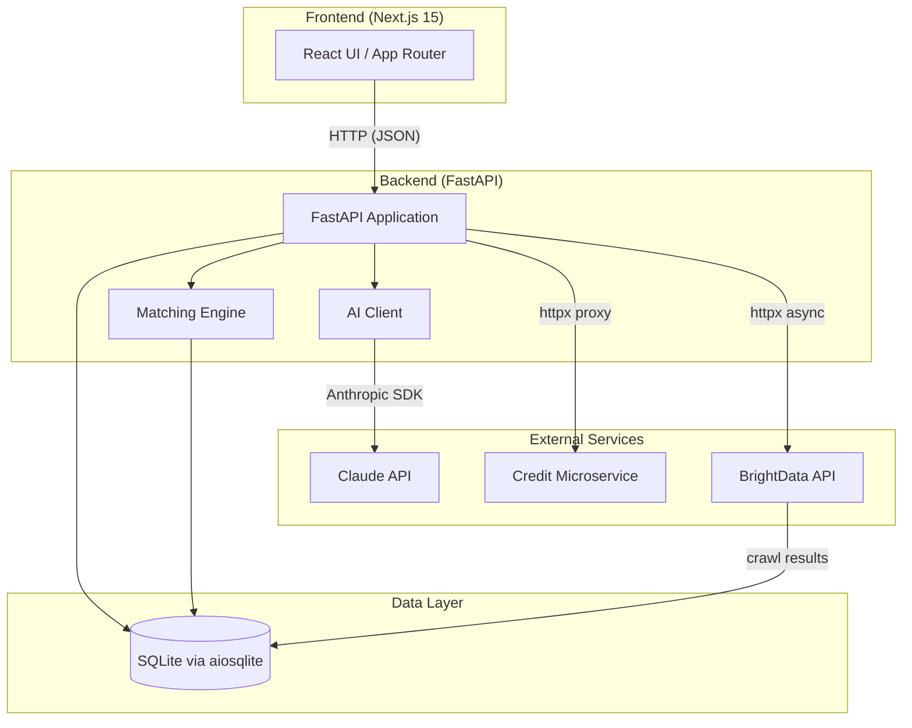
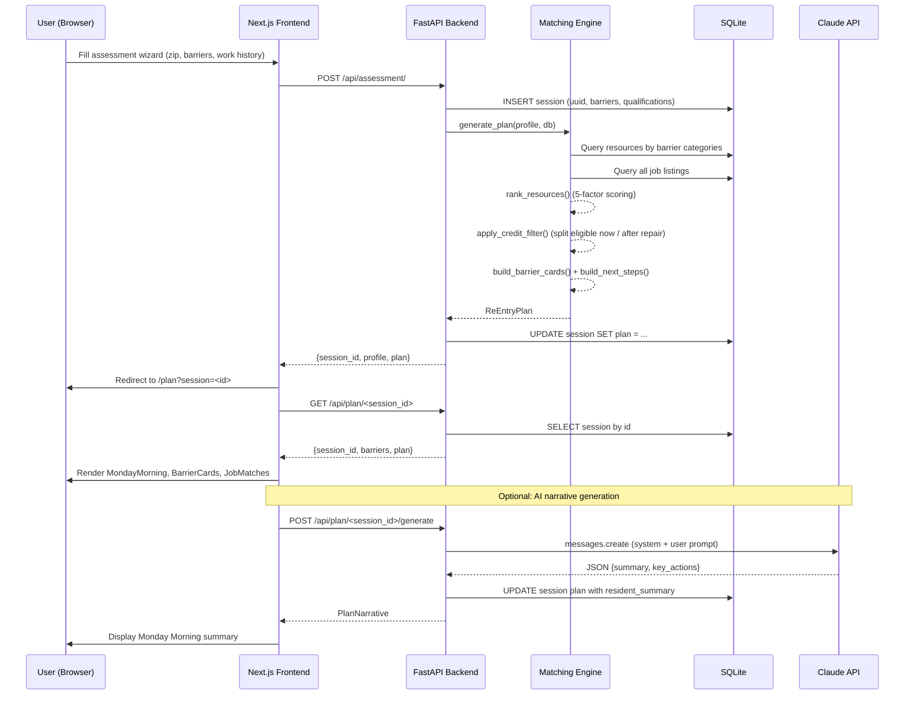
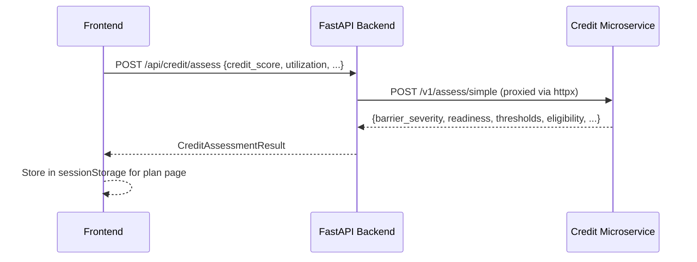

# MontGoWork Architecture

Technical architecture documentation for MontGoWork, a workforce navigator for Montgomery, Alabama.

---

## System Overview

MontGoWork is a full-stack application that helps Montgomery residents identify employment barriers and generate personalized re-entry plans. The system matches users with local resources, jobs, and transit routes, and optionally generates AI-powered narrative summaries.



### Technology Stack

| Layer | Technology | Version |
|-------|-----------|---------|
| Frontend | Next.js (App Router) | 15 |
| UI Library | React + Tailwind CSS + shadcn/ui | -- |
| State Management | TanStack React Query | -- |
| Backend | FastAPI + Uvicorn | 0.1.0 |
| ORM / DB Driver | SQLAlchemy (async) + aiosqlite | -- |
| Database | SQLite | -- |
| AI | Anthropic Python SDK (Claude) | -- |
| HTTP Client | httpx (async) | -- |
| Config | pydantic-settings (.env) | -- |

---

## Request Flow

The primary user flow: a resident completes the assessment wizard, the backend creates a session, runs the matching engine, and returns a personalized plan.



### Credit Assessment Side-Flow

When a user selects the credit barrier, the wizard includes an additional credit form step. The frontend calls the credit proxy before submitting the main assessment.



---

## Backend Modules

### Route Layer

| Route | File | Endpoints | Purpose |
|-------|------|-----------|---------|
| `/api/assessment` | `routes/assessment.py` | `POST /` | Intake form, session creation, matching pipeline |
| `/api/plan` | `routes/plan.py` | `GET /{session_id}`, `POST /{session_id}/generate` | Plan lookup, AI narrative generation |
| `/api/credit` | `routes/credit.py` | `POST /assess` | Thin proxy to credit microservice |
| `/api/jobs` | `routes/jobs.py` | `GET /`, `GET /{job_id}` | Job listings with barrier/transit/industry filters |
| `/api/feedback` | `routes/feedback.py` | `POST /resource`, `GET /validate/{token}`, `POST /visit` | Resource helpfulness and post-visit feedback |
| `/api/plan` | `routes/plan.py` | `GET /{session_id}/career-center` | Career Center Ready Package assembly |
| `/api/brightdata` | `routes/brightdata.py` | `POST /crawl`, `GET /status/{id}`, `POST /precrawl` | BrightData crawl lifecycle |
| `/health` | `health/checks.py` | `GET /health`, `GET /health/live`, `GET /health/ready` | Service health checks |

### Matching Engine

| Module | File | Responsibility |
|--------|------|---------------|
| Engine | `modules/matching/engine.py` | Orchestrates the full matching pipeline via `generate_plan()`. Queries resources and jobs, applies scoring and filters, builds barrier cards and next steps, returns a `ReEntryPlan`. |
| Scoring | `modules/matching/scoring.py` | 5-factor weighted scoring: barrier alignment (40%), proximity (20%), transit (15%), schedule (15%), industry (10%). Ranks resources by relevance to a `UserProfile`. |
| Filters | `modules/matching/filters.py` | Eligibility filters applied before or after scoring. Credit filter (splits jobs by severity), transit filter (M-Transit schedule constraints), childcare filter (proximity-based), certification renewal lookup. |
| Types | `modules/matching/types.py` | Pydantic models: `AssessmentRequest`, `UserProfile`, `Resource`, `JobMatch`, `BarrierCard`, `ReEntryPlan`, `WIOAEligibility`, enums for `BarrierType`, `BarrierSeverity`, `EmploymentStatus`, `AvailableHours`. |
| WIOA Screener | `modules/matching/wioa_screener.py` | WIOA eligibility screening: `screen_wioa_eligibility()` evaluates adult program, supportive services, ITA, and dislocated worker eligibility. `has_expired_certification()` helper for certification renewal detection. |
| Affinity | `modules/matching/affinity.py` | Resource affinity routing: `assign_resources()` maps barriers to specific resources using `RESOURCE_AFFINITY` and `BARRIER_PROCESSING_ORDER`. Routes Career Center to `immediate_next_steps`. |
| Barrier Priority | `modules/matching/barrier_priority.py` | Static barrier priority ordering: `get_barrier_priority()` returns a numeric priority (childcare=1 through training=7) for deterministic barrier card ordering. |
| Career Center Package | `modules/matching/career_center_package.py` | `assemble_package()` builds a Career Center Ready Package with staff summary, document checklist, what-to-say scripts, and credit pathway. |

### AI Module

| Module | File | Responsibility |
|--------|------|---------------|
| Client | `ai/client.py` | Calls Claude API via `AsyncAnthropic` to generate plan narratives. Includes `build_fallback_narrative()` for template-based output when the API is unavailable. |
| Prompts | `ai/prompts.py` | System prompt (Montgomery-specific workforce navigator persona) and user prompt template (barriers, qualifications, plan data). |
| Types | `ai/types.py` | `PlanNarrative` (summary + key_actions) and `AnalysisResult` models. |

### Feedback Module

| Module | File | Responsibility |
|--------|------|---------------|
| Tokens | `modules/feedback/tokens.py` | `generate_token()` creates cryptographically random 16-character URL-safe tokens via `secrets.token_urlsafe()`. `create_feedback_token()` and `validate_token()` handle DB storage with 30-day expiry. |
| Health | `modules/feedback/health.py` | `check_resource_health()` evaluates helpfulness signals (HEALTHY/WATCH/FLAGGED thresholds). `get_feedback_stats()` aggregates within a 30-day window. `update_all_health_statuses()` batch updates. |
| Types | `modules/feedback/types.py` | `ResourceHealth` enum (healthy/watch/flagged/hidden), `ResourceFeedbackRequest`, `VisitFeedbackRequest`, and response models. |
| Queries | `core/queries_feedback.py` | Async query helpers: `insert_resource_feedback` (upsert), `token_exists`, `validate_token`, `has_visit_feedback`, `insert_visit_feedback`, `session_exists`. |

### BrightData Integration

| Module | File | Responsibility |
|--------|------|---------------|
| Client | `integrations/brightdata/client.py` | Async HTTP wrapper around BrightData Datasets API v3. Supports `trigger_crawl()` and `get_snapshot_status()`. |
| Polling | `integrations/brightdata/polling.py` | Exponential backoff poller with jitter. `poll_until_ready()` retries up to 30 times (max 60s delay). |
| Cache | `integrations/brightdata/cache.py` | Parses raw BrightData JSON into `BrightDataJobRecord`, deduplicates by URL, and bulk-inserts into `job_listings`. |
| Pre-crawl | `integrations/brightdata/precrawl.py` | Admin utility to pre-populate Montgomery job data. Targets Indeed and LinkedIn searches for Montgomery, AL. Skips if data less than 24 hours old exists. |
| Types | `integrations/brightdata/types.py` | `CrawlStatus`, `CrawlProgress`, `CrawlResult`, `BrightDataJobRecord`, request/response models, custom exceptions. |

### Core Layer

| Module | File | Responsibility |
|--------|------|---------------|
| Config | `core/config.py` | `Settings` via pydantic-settings. Reads from `.env`. Holds database URL, API keys, CORS origins, Claude model selection. |
| Database | `core/database.py` | Async SQLAlchemy engine + session factory. Raw DDL for table creation. JSON seed loader for Montgomery data (resources, transit routes, employers). |
| Queries | `core/queries.py` | Async query helpers: `get_all_resources`, `get_resources_by_category`, `get_all_transit_routes`, `get_all_employers`, `create_session`, `get_session_by_id`, `update_session_plan`, `get_all_job_listings`, `insert_job_listings`. |
| Credit Types | `modules/credit/types.py` | `SimpleCreditRequest` and `CreditAssessmentResult` Pydantic models for the credit proxy route. |

---

## Database Schema

All tables are created via raw DDL in `core/database.py` and use SQLite (async via aiosqlite).

### Tables

#### sessions

Stores assessment sessions with a 24-hour expiry. The `plan` column holds the full `ReEntryPlan` as serialized JSON.

| Column | Type | Notes |
|--------|------|-------|
| id | TEXT | Primary key (UUID) |
| created_at | TEXT | ISO 8601 timestamp |
| barriers | TEXT | JSON array of barrier type strings |
| credit_profile | TEXT | Optional JSON |
| qualifications | TEXT | Free-text work history |
| plan | TEXT | Serialized `ReEntryPlan` JSON |
| profile | TEXT | Serialized `UserProfile` JSON (for career center package reconstruction) |
| expires_at | TEXT | ISO 8601 timestamp (created_at + 24h) |

#### resources

Montgomery-area support resources seeded from JSON files.

| Column | Type | Notes |
|--------|------|-------|
| id | INTEGER | Primary key (auto) |
| name | TEXT | Resource name |
| category | TEXT | One of: `social_service`, `career_center`, `childcare`, `training` |
| subcategory | TEXT | Optional specialization |
| address | TEXT | Street address |
| lat, lng | REAL | Coordinates |
| phone | TEXT | Contact phone |
| url | TEXT | Website |
| eligibility | TEXT | Eligibility criteria |
| services | TEXT | JSON array of services offered |
| hours | TEXT | Operating hours |
| notes | TEXT | Additional notes |

#### employers

Montgomery businesses (seeded from `montgomery_businesses.json`).

| Column | Type | Notes |
|--------|------|-------|
| id | INTEGER | Primary key (auto) |
| name | TEXT | Business name |
| address | TEXT | Street address |
| lat, lng | REAL | Coordinates |
| license_type | TEXT | Used for credit check determination |
| industry | TEXT | Industry classification |
| active | INTEGER | 1 = active, 0 = inactive |

#### job_listings

Job listings from BrightData crawls or manual seed.

| Column | Type | Notes |
|--------|------|-------|
| id | INTEGER | Primary key (auto) |
| title | TEXT | Job title |
| company | TEXT | Employer name |
| location | TEXT | Job location |
| description | TEXT | Job description |
| url | TEXT | Application URL |
| source | TEXT | Origin (e.g., `brightdata:<snapshot_id>`) |
| scraped_at | TEXT | ISO 8601 timestamp |
| expires_at | TEXT | Listing expiration |

#### feedback_tokens

Feedback tokens for post-visit follow-up. Generated during assessment, expire after 30 days.

| Column | Type | Notes |
|--------|------|-------|
| token | TEXT | Primary key (16-char cryptographically random URL-safe) |
| session_id | TEXT | FK to sessions |
| created_at | TEXT | ISO 8601 timestamp |
| expires_at | TEXT | ISO 8601 timestamp (created_at + 30 days) |

#### visit_feedback

Post-visit feedback submitted via the `/feedback/[token]` page.

| Column | Type | Notes |
|--------|------|-------|
| id | INTEGER | Primary key (auto) |
| session_id | TEXT | FK to sessions |
| submitted_at | TEXT | ISO 8601 timestamp |
| made_it_to_center | INTEGER | 0=no, 1=yes, 2=plan to |
| outcomes | TEXT | JSON array of outcome labels |
| plan_accuracy | INTEGER | 1-3 rating |
| free_text | TEXT | Optional comment (max 1000 chars) |
| reviewed | INTEGER | 0=unreviewed, 1=reviewed (default 0) |
| action_taken | TEXT | Staff notes on follow-up |

#### resource_feedback

Per-resource helpfulness votes. One vote per resource per session (upsert).

| Column | Type | Notes |
|--------|------|-------|
| id | INTEGER | Primary key (auto) |
| resource_id | INTEGER | FK to resources |
| session_id | TEXT | FK to sessions |
| helpful | INTEGER | 1=helpful, 0=not helpful |
| barrier_type | TEXT | Barrier context for the feedback |
| submitted_at | TEXT | ISO 8601 timestamp |
| | | UNIQUE(resource_id, session_id) |

#### transit_routes

Montgomery M-Transit bus routes.

| Column | Type | Notes |
|--------|------|-------|
| id | INTEGER | Primary key (auto) |
| route_number | INTEGER | Route number |
| route_name | TEXT | Route name |
| weekday_start | TEXT | e.g., "05:00" |
| weekday_end | TEXT | e.g., "21:00" |
| saturday | INTEGER | 1 = runs Saturday |
| sunday | INTEGER | 0 = no Sunday service |

#### transit_stops

Individual stops along transit routes.

| Column | Type | Notes |
|--------|------|-------|
| id | INTEGER | Primary key (auto) |
| route_id | INTEGER | FK to transit_routes |
| stop_name | TEXT | Stop name |
| lat, lng | REAL | Coordinates |
| sequence | INTEGER | Stop order on route |

### Seed Data

The database is seeded on first startup from JSON files in the `data/` directory:

| File | Target Table |
|------|-------------|
| `montgomery_businesses.json` | employers |
| `transit_routes.json` | transit_routes |
| `career_centers.json` | resources (category: career_center) |
| `training_programs.json` | resources (category: training) |
| `childcare_providers.json` | resources (category: childcare) |
| `community_resources.json` | resources (category: social_service) |
| `job_listings.json` | job_listings |

---

## Frontend Architecture

### Pages (App Router)

| Route | File | Purpose |
|-------|------|---------|
| `/` | `app/page.tsx` | Landing page with hero, how-it-works steps, Montgomery stats, and CTA |
| `/assess` | `app/assess/page.tsx` | Multi-step assessment wizard (basic info, barriers, optional credit, review/submit) |
| `/plan` | `app/plan/page.tsx` | Plan results page with barrier cards, job matches, credit results, comparison view, and export options |
| `/credit` | `app/credit/page.tsx` | Standalone credit assessment form and results display |
| `/feedback/[token]` | `app/feedback/[token]/page.tsx` | Post-visit feedback form (mobile-first, token-validated) |

### Component Hierarchy

```
app/
  layout.tsx
    Header
    page.tsx                        -- Landing page
    assess/page.tsx                 -- Assessment wizard
      WizardShell                   -- Step navigation, progress, next/back/submit
        BarrierForm                 -- Barrier checkbox grid with descriptions
        CreditForm                  -- Credit self-assessment sliders and inputs
    plan/page.tsx                   -- Plan results
      MondayMorning                 -- AI narrative hero section (summary + key actions)
      BarrierCardView               -- Individual barrier card (actions + matched resources)
      JobMatchCard                  -- Job match with eligibility badge and apply link
      ComparisonView                -- Side-by-side eligible now vs after repair comparison
      CreditResults                 -- Credit assessment results (severity, thresholds, eligibility)
      PlanExport                    -- Download plan as formatted PDF
      EmailExport                   -- Email plan via mailto link
      CareerCenterExport            -- Download Career Center Ready Package as PDF
      PdfFeedbackQR                 -- QR code linking to feedback page
    credit/page.tsx                 -- Standalone credit form
    feedback/[token]/page.tsx       -- Post-visit feedback form
      FeedbackForm                  -- Mobile-first 3-question form with token validation
    ErrorBoundary                   -- Global error boundary
    EmptyState                      -- Empty state placeholder
```

### Key Components

| Component | File | Responsibility |
|-----------|------|---------------|
| `WizardShell` | `components/wizard/WizardShell.tsx` | Generic multi-step wizard with step indicators, validation gates, and configurable complete action. |
| `BarrierForm` | `components/wizard/BarrierForm.tsx` | Renders barrier type checkboxes (credit, transportation, childcare, housing, health, training, criminal record) with descriptions. |
| `CreditForm` | `components/wizard/CreditForm.tsx` | Credit self-assessment with score slider, utilization, payment history, account age, and negative item selection. |
| `MondayMorning` | `components/plan/MondayMorning.tsx` | Displays the AI-generated "Monday Morning" narrative and immediate next steps from the plan. |
| `BarrierCardView` | `components/plan/BarrierCardView.tsx` | Renders a single barrier card: type, severity, action steps, and matched Montgomery resources. |
| `JobMatchCard` | `components/plan/JobMatchCard.tsx` | Displays a job match with company, location, eligibility status, credit check indicator, and apply link. |
| `ComparisonView` | `components/plan/ComparisonView.tsx` | Side-by-side view comparing jobs eligible now vs. eligible after credit repair. |
| `CreditResults` | `components/plan/CreditResults.tsx` | Renders credit assessment output: severity badge, thresholds timeline, product eligibility, and dispute pathway. |
| `PlanExport` | `components/plan/PlanExport.tsx` | Generates a downloadable PDF of the plan via html2pdf.js. |
| `EmailExport` | `components/plan/EmailExport.tsx` | Sends the plan via the EmailJS API to the resident's email address. |
| `CareerCenterExport` | `components/plan/CareerCenterExport.tsx` | Fetches Career Center Ready Package, renders `CareerCenterPrintLayout` offscreen, exports as date-stamped PDF. |
| `CareerCenterPrintLayout` | `components/plan/CareerCenterPackage.tsx` | 3-page print layout: staff summary, resident plan, credit pathway. Uses forwardRef. Exported from `CareerCenterPackage.tsx`. |
| `PdfFeedbackQR` | `components/plan/PdfFeedbackQR.tsx` | QR code (level M, 100px) encoding the feedback page URL for inclusion in PDF exports. |
| `FeedbackForm` | `app/feedback/[token]/feedback-form.tsx` | Mobile-first 3-question post-visit feedback form with token validation, conditional outcomes, large touch targets. |

### Data Fetching

The frontend uses TanStack React Query for server state management:

| Hook | API Call | Trigger |
|------|----------|---------|
| `useMutation` | `POST /api/assessment/` | Wizard submit button |
| `useQuery` | `GET /api/plan/{session_id}` | Plan page load |
| `useMutation` | `POST /api/plan/{session_id}/generate` | Auto-triggered on plan load (once) |
| `useQuery` | `GET /api/jobs/?barriers=...` | Plan page load (after plan data available) |
| `useMutation` | `POST /api/credit/assess` | Credit form submit (wizard or standalone) |
| `useMutation` | `POST /api/feedback/resource` | Thumbs up/down on resource cards |
| `useQuery` | `GET /api/feedback/validate/{token}` | Feedback page load (token validation) |
| `useMutation` | `POST /api/feedback/visit` | Visit feedback form submit |
| `useQuery` | `GET /api/plan/{session_id}/career-center` | Career Center export button click |

---

## External Services

| Service | Base URL | Purpose | Auth Method |
|---------|----------|---------|-------------|
| Claude API | `https://api.anthropic.com` | Generate personalized plan narratives ("Monday Morning" summary and key actions) | Bearer token (`ANTHROPIC_API_KEY`) via Anthropic SDK |
| Credit Microservice | Configurable (`CREDIT_API_URL`, default `http://localhost:8001`) | Credit barrier assessment: severity scoring, threshold analysis, product eligibility, dispute pathways | API key header (`X-API-Key`) |
| BrightData Datasets API v3 | `https://api.brightdata.com/datasets/v3` | Async web crawling of job boards (Indeed, LinkedIn) for Montgomery, AL job listings | Bearer token (`BRIGHTDATA_API_KEY`) |

### Failure Modes

| Service | Failure Behavior |
|---------|-----------------|
| Claude API | Falls back to `build_fallback_narrative()` -- template-based summary built from plan data. Logged as warning. |
| Credit Microservice | Returns HTTP 503 (unavailable), 504 (timeout), or 502 (network error) to the frontend. Frontend shows error and continues without credit data. |
| BrightData API | Returns HTTP 502 with error detail. Pre-crawl skips if recent data exists (24h cache). Polling times out after 30 retries with exponential backoff. |

---

## Configuration

All configuration is managed via environment variables loaded by pydantic-settings from `.env`:

| Variable | Default | Purpose |
|----------|---------|---------|
| `DATABASE_URL` | `sqlite+aiosqlite:///./montgowork.db` | SQLite database path |
| `CREDIT_API_URL` | `http://localhost:8001` | Credit microservice base URL |
| `CREDIT_API_KEY` | (empty) | API key for credit microservice |
| `ANTHROPIC_API_KEY` | (empty) | Anthropic API key for Claude |
| `CLAUDE_MODEL` | `claude-sonnet-4-20250514` | Claude model identifier |
| `BRIGHTDATA_API_KEY` | (empty) | BrightData API key |
| `BRIGHTDATA_DATASET_ID` | (empty) | BrightData dataset identifier |
| `CORS_ORIGINS` | `http://localhost:3000` | Comma-separated allowed origins |
| `LOG_LEVEL` | `INFO` | Python logging level |

---

## Scoring Algorithm

The matching engine scores each resource against a user profile using five weighted factors:

| Factor | Weight | Description |
|--------|--------|-------------|
| Barrier alignment | 0.40 | Does the resource category match the user's barriers? (1.0 if match, 0.1 base) |
| Proximity | 0.20 | Haversine distance from user ZIP centroid to resource lat/lng. Linear decay: 1mi=1.0, 15mi=0.1. Returns 0.5 (neutral) when coordinates are unavailable. |
| Transit accessibility | 0.15 | Penalizes transit-dependent users needing night (0.2) or flexible/Sunday (0.6) access due to M-Transit constraints. |
| Schedule compatibility | 0.15 | Matches resource hours to user schedule preference (daytime, evening, night, flexible). |
| Industry alignment | 0.10 | Checks if resource services/notes mention user's target industries. |

Resources are ranked by descending score. Score bands: strong_match (>= 0.80), good_match (>= 0.60), possible_match (>= 0.40), weak_match (< 0.40).

---

## Barrier Types and Category Mapping

The matching engine maps each barrier type to resource categories for querying:

| Barrier Type | Resource Categories |
|-------------|-------------------|
| `credit` | career_center, social_service |
| `transportation` | career_center |
| `childcare` | childcare |
| `housing` | social_service |
| `health` | social_service |
| `training` | training, career_center |
| `criminal_record` | career_center, social_service |

Barrier severity is determined by count: 1 barrier = LOW, 2 = MEDIUM, 3+ = HIGH. Severity affects the credit filter behavior (HIGH excludes all credit-check jobs; MEDIUM excludes only finance/government credit-check jobs; LOW applies no filter).

---

## Known Limitations & Scaling Path

1. **SQLite → PostgreSQL:** Single-file database, limited concurrent writes. Migration path: swap `aiosqlite` for `asyncpg`, update `DATABASE_URL` format (`postgresql+asyncpg://...`). Railway managed Postgres or Supabase are drop-in replacements with no schema changes required — SQLAlchemy handles the abstraction.

2. **Static resource data:** Resources loaded from JSON at startup, no automated refresh. Path: nightly cron via BrightData for job listings (routes already exist at `POST /api/brightdata/precrawl`). Manual review cadence for static resources; user feedback loop (implemented — resource health decay with HEALTHY/WATCH/FLAGGED/HIDDEN statuses) handles decay detection via helpfulness signals.

3. **No caching layer:** All requests hit SQLite directly. Path: Redis for job listings (24h TTL) and resource queries (1h TTL). FastAPI middleware for cache-aside pattern.

4. **External API resilience:** BrightData polling already has exponential backoff with jitter (2-60s, 30 retries). Credit API returns 503/504/502 on failure. Claude API falls back to template narrative. Missing: circuit breaker pattern. Path: `tenacity` for retry decorators, `pybreaker` for circuit breakers on future integrations.

5. **Security hardening:** Rate limiting exists on `/api/assessment` (10 req/60s per IP). Missing: per-endpoint limits on all routes. Path: `slowapi` for full route coverage, Cloudflare proxy for DDoS protection.

6. **Horizontal scaling:** Single process, single SQLite file. Decomposition path: API service and scraping workers as separate Railway services, PostgreSQL as managed addon, Redis as Railway plugin. No application code changes required — infrastructure decomposition only.
